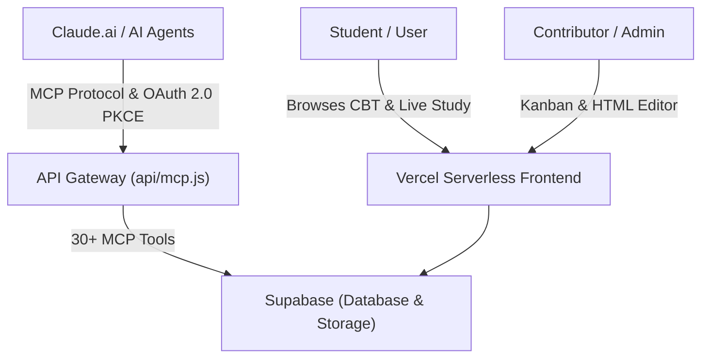
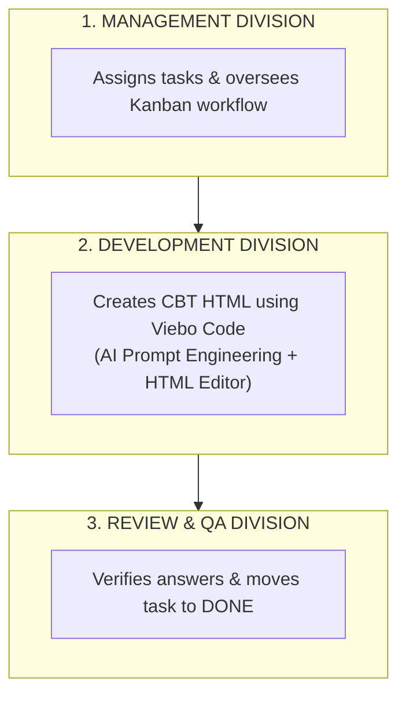

<p align="center">
  
</p>

<p align="center">
  <a href="https://mr-capsules.vercel.app"></a>
  <a href="https://mr-capsules.vercel.app/docs.html"></a>
  
  
</p>

---

## 📖 About MR-CAPSULES

**MR-CAPSULES** is a non-profit open-source educational sanctuary established in August 2025, dedicated to preserving, sharing, and transforming academic materials for medical and health science students.

What started as shared HTML notes among friends has evolved into an **advanced, web-based educational ecosystem**. The platform converts dense lecture slides, past exam questions, and practicum manuals into centralized, interactive **Choice-Based Test (CBT) question pools**, **OSCE practice modules**, and **Live Study Rooms**.

Beyond serving as a static archive, MR-CAPSULES functions as a **hybrid platform** equipped with an **Admin Management Portal**, an **integrated Kanban workflow**, and a full **Model Context Protocol (MCP) serverless API gateway** for seamless AI assistant collaboration.

🌐 **Live Platform:** [https://mr-capsules.vercel.app](https://mr-capsules.vercel.app)  
📚 **Interactive Documentation:** [https://mr-capsules.vercel.app/docs.html](https://mr-capsules.vercel.app/docs.html)

---

## 🚀 What's New in v2.0 (Recent Updates)

| Ecosystem Module | Core Features & Capabilities |
| :--- | :--- |
| 🤖 **AI Agent Gateway** | MCP 2025-06-18 Protocol (`/api/mcp`), 30+ Tools, OAuth 2.0 PKCE Auto-Discovery (RFC 8414 / RFC 7591). |
| 🎛️ **Admin Portal** | 5-step Kanban Board (`Open` &rarr; `Done`), CodeMirror Live Editor, Division & Device Security Controls. |
| ⚡ **Live & CBT Engine** | Interactive CBT Question Pools, Flashcard System, Realtime Live Study Rooms. |

### 1. 🤖 Model Context Protocol (MCP) & API Gateway Integration
- **Serverless MCP Protocol (2025-06-18 standard)**: Built-in native support for external AI Agents (Claude Web, Claude Desktop, Antigravity, Custom Agents) at `/api/mcp`.
- **OAuth 2.0 PKCE Auto-Discovery (RFC 8414 & RFC 7591)**: Native registration support for Claude.ai custom connectors without manual OAuth configuration.
- **30+ Specialized MCP Tools**: AI agents can inspect, edit, create, and manage system resources across:
  - `docs_*`: Section management, dynamic tab manipulation (`docs_add_tab`, `docs_update_tab`), with automatic zero inline-style and `.docs-table` class sanitization.
  - `tasks_*`: Workflow tasks management (`tasks_unclaim`, `tasks_start_review`, `tasks_add_note`, `tasks_delete`).
  - `users_*` & `divisions_*`: User blocking, device removal, team management (`divisions_get_members`, `divisions_join`).
  - `cover_*`: Storage cover image management (`cover_list`, `cover_upload`, `cover_delete`).
  - `activity_logs` & `system_cleanup_guests`: System maintenance and monitoring.

### 2. 🎛️ Comprehensive Admin Portal (`admin.html`)
- **Dashboard & Telemetry**: Live system uptime tracker, active member counts, hybrid activity log stream, and contributor leaderboard.
- **Files & Live HTML Editor**: Built-in CodeMirror code editor with real-time live preview for instant CBT question verification.
- **Task Management Board**: 5-column Kanban board (`Open`, `In Progress`, `Developed`, `In Review`, `Done`) integrated with Syllabus filters (CBT, OSCE, Video, Summary).
- **Security & Device Controls**: Role-based access control (Admin, Contributor, Banned), remote device revocation, and guest session cleanup.

### 3. 📖 Modernized Interactive Documentation (`docs.html`)
- Complete redesign using CSS Design Tokens (`tokens.css`) and responsive glassmorphic cards.
- **Dynamic Tab Switcher**: Separates **Panduan Umum (General Contributor Guide)** and **MCP & API Gateway Integration Guide**.

### 4. ⚡ Live Study Room Engine (`live.html`)
- Real-time study sessions, flashcards, live quizzes, and interactive practice pools for exam preparation.

---

## 🎯 Mission & Value Proposition

- 📚 **Preserve Knowledge:** Prevent valuable study materials and past questions from getting lost over time.
- ⚡ **Interactive CBT Format:** Convert static PDFs/notes into interactive choices with immediate answer verification and explanations.
- 🤝 **AI-Assisted Content Pipeline ("Viebo Code"):** Content creators work as Prompt Engineers alongside AI assistants to generate clean HTML question pools rapidly.
- 🔓 **Open Access:** Completely free and non-profit for all students.

---

## 📂 Resource Categories

| Category | Description & Format |
| :--- | :--- |
| **Soal Tahun Kemarin** | Transformed into interactive HTML CBT choice-based practice pools. |
| **Praktikum (Practicum)** | Structured lab manuals and question banks formatted as CBT modules. |
| **Lecture (Materi Kuliah)** | Concise lecture notes and summary question pools. |
| **Faculty Slides (PPT/PDF)** | Preserved presentation archives and reference docs. |
| **Live Study Sessions** | Realtime flashcards, practice pools, and live study sessions. |

---

## 🛠️ Architecture & Tech Stack



### Core Technologies
- **Frontend Layer:** HTML5, CSS3 (Tokens architecture via `tokens.css`, `global-styles.css`), Vanilla JS, CodeMirror 5.
- **Backend / API Layer:** Vercel Serverless Functions (`api/mcp.js`, `api/admin.js`, `api/tasks.js`, `api/divisions.js`, etc.).
- **Database & Storage:** Supabase Database (PostgreSQL) + Supabase Storage (Covers & Content).
- **AI Infrastructure:** Model Context Protocol (MCP 2025-06-18) + OAuth 2.0 PKCE Auto-Discovery (RFC 8414/7591).
- **Hosting & CI/CD:** Vercel Platform.

---

## 🤝 Division & Contribution Workflow

MR-CAPSULES operates through three collaborative divisions:



### 👥 Division Roles
1. **Division Management (Pengurus):** Assigns tasks on the Kanban board, manages member permissions, broadcasts announcements, and oversees project progress.
2. **Division Development (Pembuat Konten):** Uses **Viebo Code** (generating code using AI like Claude / Antigravity) to create CBT question pools and HTML content, placing them in *Developed (Wait for Review)*.
3. **Division Review & QA (Koreksi):** Inspects live previews in the HTML editor, validates key answers against references, and moves verified tasks to *Done*.

---

## 🔌 Connecting AI Assistants (Claude & ChatGPT Custom GPTs)

You can connect **Claude.ai Web**, **Claude Desktop**, **ChatGPT Custom GPTs**, or **Autonomous Agents** to MR-CAPSULES:

### 🟣 A. Claude.ai Web & Desktop (Streamable HTTP MCP)
1. Open **Admin Panel** &rarr; **API Keys** tab &rarr; click **+ Generate Key** to create your API key (`mrc_...`).
2. In **Claude.ai**: Go to `Settings` &rarr; `Connectors` &rarr; `Add Custom Connector`.
3. Enter Name: `Mr Capsules`, URL: `https://mr-capsules.vercel.app/api/mcp`.
4. Click **Connect** (OAuth 2.0 PKCE auto-discovery will automatically authorize your agent!).

### 🟢 B. ChatGPT Custom GPTs (OpenAPI 3.0.3 Actions)
1. In **ChatGPT**: Go to `Explore GPTs` &rarr; `Create / Configure` &rarr; scroll to `Actions` &rarr; click `Create new action`.
2. Click **Import from URL** and enter OpenAPI Schema URL:
   - **Essential Preset (~24 Tools, Recommended for OpenAI 30-Limit):** `https://mr-capsules.vercel.app/api/openapi.json`
   - **DoctorTablet Medical Vault (8 Tools):** `https://mr-capsules.vercel.app/api/openapi.json?category=doctortablet`
   - **Content & File Storage (12 Tools):** `https://mr-capsules.vercel.app/api/openapi.json?category=content`
   - **Tasks & Kanban (14 Tools):** `https://mr-capsules.vercel.app/api/openapi.json?category=tasks`
3. Set **Authentication**:
   - **API Key (Bearer):** Paste your `mrc_...` key.
   - **OAuth 2.0:** Auth URL `https://mr-capsules.vercel.app/authorize`, Token URL `https://mr-capsules.vercel.app/token`, Scope `mcp`.
4. Set **Privacy Policy URL:** `https://mr-capsules.vercel.app/docs#privacy`.

---

## 💻 Local Development Setup

### Prerequisites
- Node.js (v18+)
- npm

### Installation
```bash
# Clone the repository
git clone https://github.com/alchemist4real/MR-CAPSULES.git
cd MR-CAPSULES

# Install dependencies
npm install

# Run static build script
npm run build
```

---

## ⚠️ Disclaimer

MR-CAPSULES is an independent, non-profit educational initiative. All materials are provided strictly for educational purposes. Ownership of lecture content and slides remains with respective authors, lecturers, and academic institutions.

If any material violates copyright or institutional policies, maintainers will review and take down the content upon valid request.

---

<p align="center">
  <sub>Preserving knowledge • Sharing opportunities • Empowering students</sub><br>
  <b>MR-CAPSULES • Since August 2025</b>
</p>
